# Home Lab Setup

## Overview

This document outlines my current cybersecurity home lab environment and setup.

## Host Machine

- Device: Lenovo Yoga 2-in-1
- Operating System: Windows 11 Pro
- RAM: 16GB
- Storage: 1TB

## Virtualization

Platform:
- VirtualBox

## Virtual Machine Environment

The home lab was built using Oracle VirtualBox to create an isolated cybersecurity practice environment. The initial setup includes Kali Linux and Ubuntu virtual machines configured for security testing, Linux administration, and networking practice.

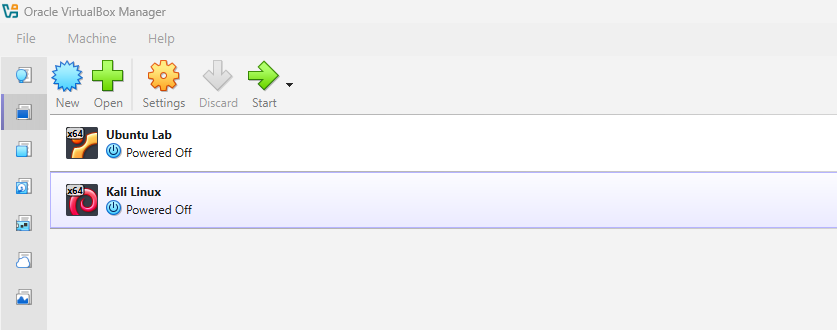

## Initial Virtual Machine Resource Configuration

The initial home lab environment was created using Oracle VirtualBox. Resources were allocated to support Linux learning, cybersecurity tool exploration, and hands-on practice while maintaining performance on the host system.

### Initial Kali Linux VM Resources

- RAM: 4 GB
- CPU: 2 processors

The initial Kali Linux virtual machine was configured as a security testing workstation for learning cybersecurity tools and practicing security concepts.

Purpose:
- Security testing environment
- Learning cybersecurity tools
- Hack The Box practice

Current Skills:
- Basic familiarity with navigating the environment
- Have used tools such as Nmap during guided exercises

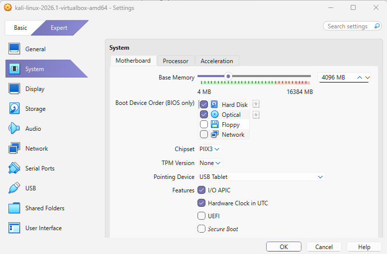

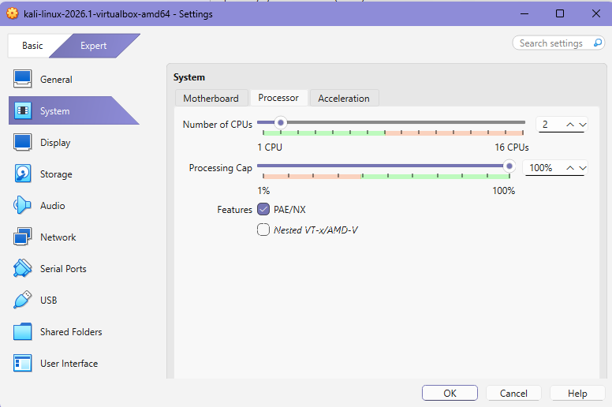

### Initial Ubuntu VM Resources

The initial Ubuntu virtual machine was created as a Linux practice environment and foundation for future security exercises.

Purpose:
- Linux practice environment
- Target machine for networking and security exercises

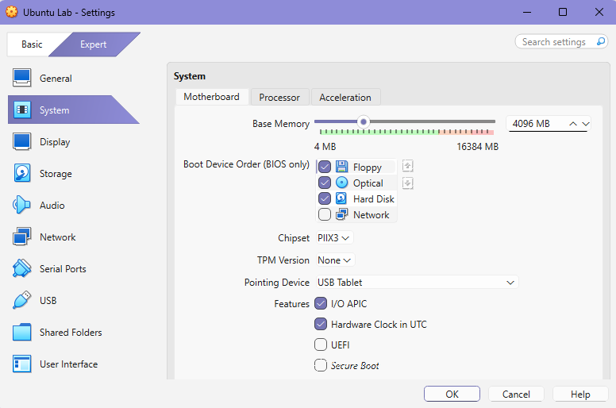

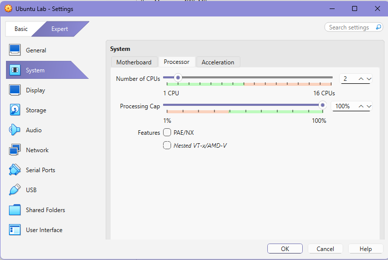

## Initial Network Configuration

The initial lab environment used a VirtualBox Host-Only Network to provide communication between virtual machines while keeping the lab isolated from the home network. This configuration allowed safe experimentation with Linux administration and introductory cybersecurity exercises.

### Network Design

- One network adapter configured per virtual machine
- Host-only networking used for isolated lab exercises
- Adapter settings changed as needed depending on the lab activity
- Internet connectivity temporarily enabled only when performing software updates or installing new tools

### Why Host-Only Networking?

Using a host-only network allows virtual machines to communicate with each other while remaining isolated from external devices. This provides a controlled environment for learning networking concepts and practicing cybersecurity techniques without affecting the home network.

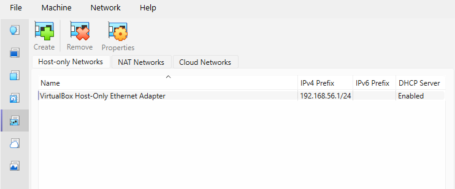

## Expanded Three-VM Lab Architecture

After establishing the initial lab environment, I expanded the infrastructure into a three-virtual-machine architecture to better simulate a real-world cybersecurity environment. The updated lab consists of a dedicated Kali Linux workstation for security testing, an Ubuntu SOC workstation for future monitoring and analysis, and an Ubuntu target machine for Linux administration practice and security exercises.

This architecture provides a foundation for developing skills in networking, system administration, vulnerability assessment, and, eventually, security monitoring and incident response.

### Virtual Machine Architecture

The following diagram shows the current VirtualBox environment containing all three virtual machines.

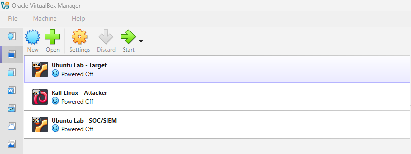

### Kali Linux Security Workstation

The Kali Linux virtual machine serves as the primary security testing workstation within the lab. It is configured with a static IP address on the isolated host-only network to allow communication with the Ubuntu virtual machines.

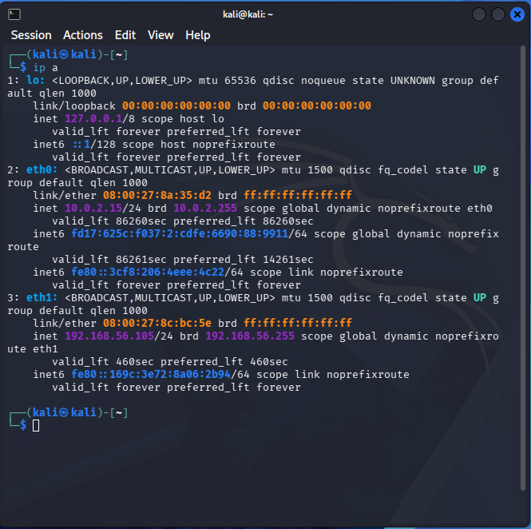

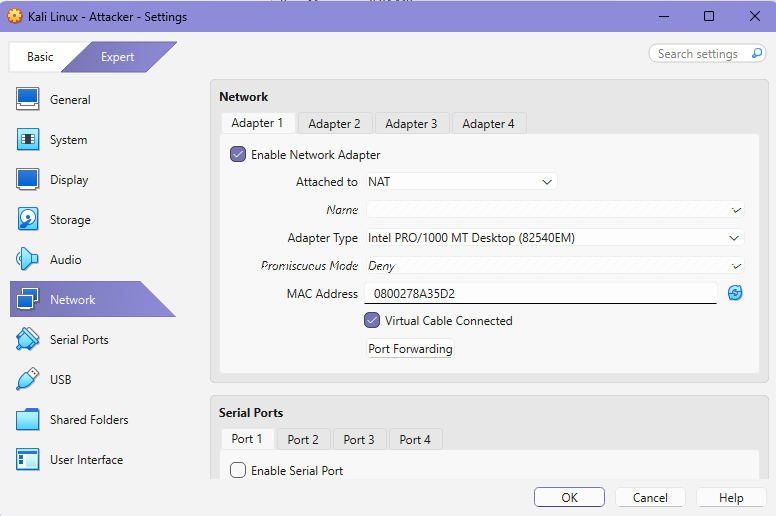

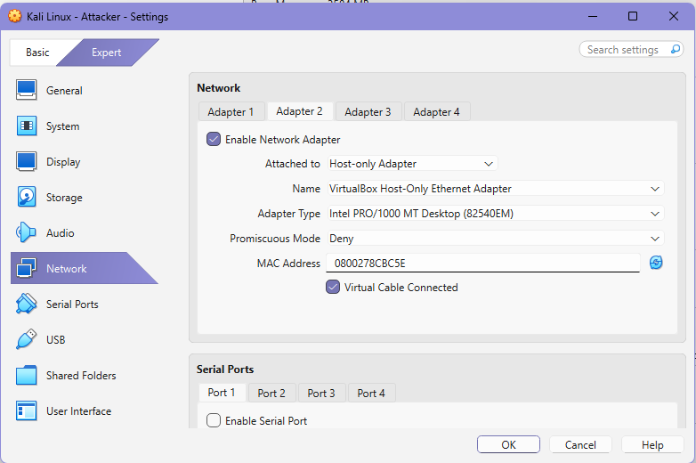

### Ubuntu SOC Workstation

The Ubuntu SOC virtual machine functions as the security monitoring server within the lab environment. It is configured to support defensive cybersecurity exercises involving security monitoring, log analysis, vulnerability assessment, and incident response concepts.

The SOC workstation currently hosts Wazuh as the Security Information and Event Management (SIEM) platform. Wazuh provides centralized security monitoring capabilities by collecting endpoint data, analyzing security events, and generating alerts.

Installed Components:
- Wazuh Manager
- Wazuh Indexer
- Wazuh Dashboard
- Filebeat

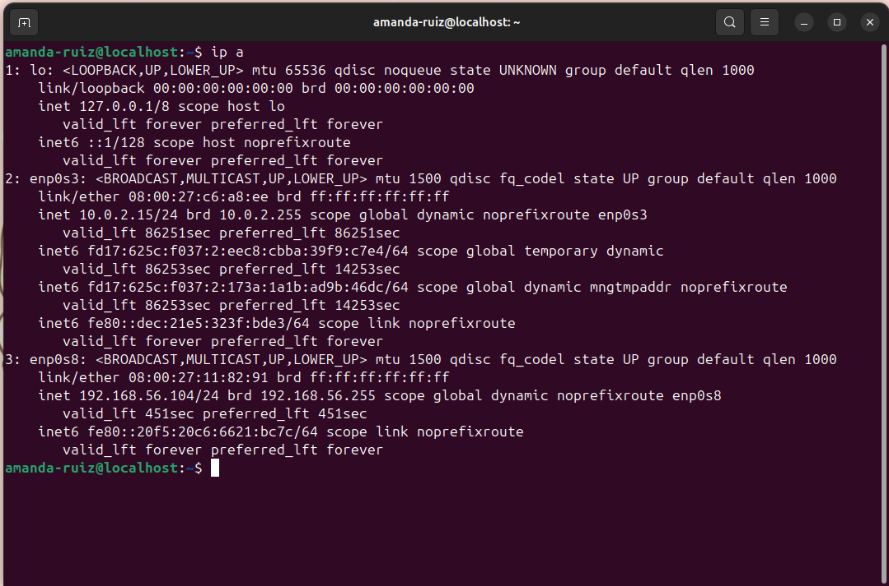

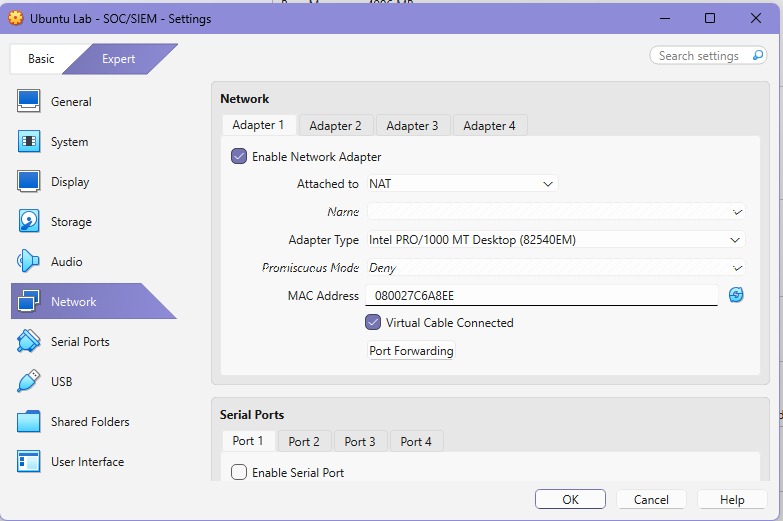

### Ubuntu Target Machine

The Ubuntu Target virtual machine serves as a Linux system for administration practice, networking exercises, and future security testing. Like the other virtual machines, it is configured with a static IP address to ensure reliable communication within the isolated lab environment.

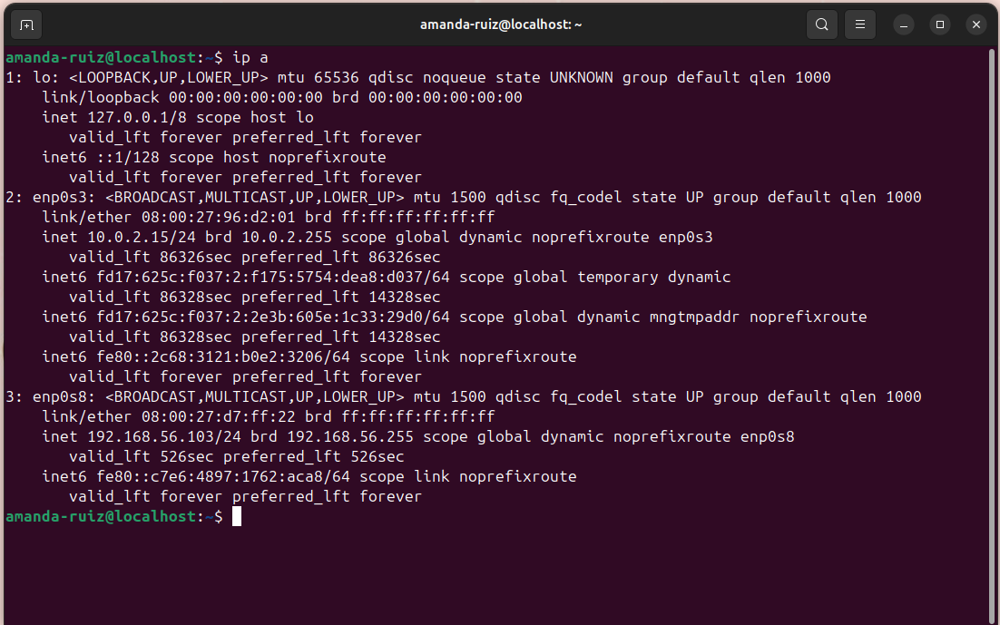

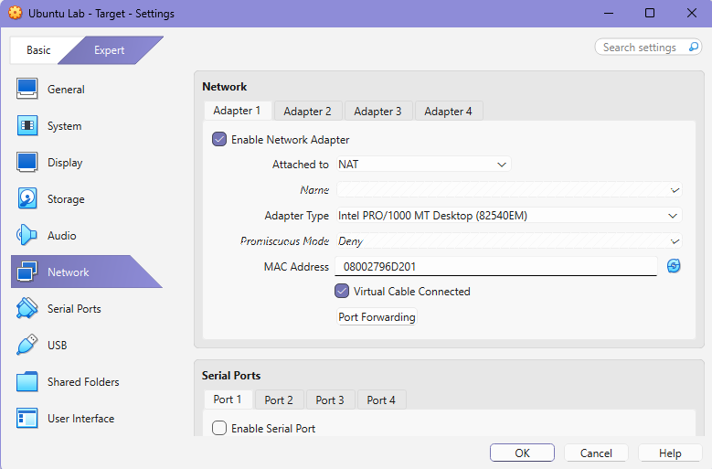

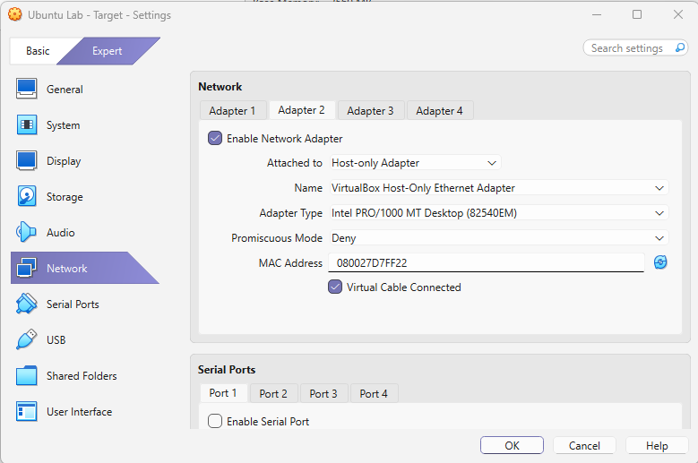

## Current Lab Summary

The home lab has evolved from a basic two-virtual-machine environment into a dedicated three-VM cybersecurity lab designed to support continued learning throughout my Bachelor of Applied Science in Cybersecurity program.

### Current Environment

| Virtual Machine | Primary Purpose |
|-----------------|-----------------|
| Kali Linux | Security testing, Linux administration, and cybersecurity tools |
| Ubuntu SOC | Security monitoring, log analysis, and future defensive security projects |
| Ubuntu Target | Linux administration, networking practice, and security testing target |

### Current Capabilities

The lab currently supports:

- Virtual machine administration using Oracle VirtualBox
- Linux command-line navigation
- Host-only network configuration
- Static IP address configuration
- Multi-VM communication within an isolated environment
- Security testing using Kali Linux
- Centralized security monitoring using Wazuh
- Security event collection and analysis
- Documentation of lab configuration and changes

### Planned Enhancements

As I continue building this lab, I plan to add:

- SSH administration between virtual machines
- Packet capture and analysis with Wireshark
- Vulnerability assessment workflows
- MITRE ATT&CK mapping exercises
- Security logging and event analysis
- Endpoint monitoring using Wazuh agents
- Incident response scenarios
- Additional defensive security projects
