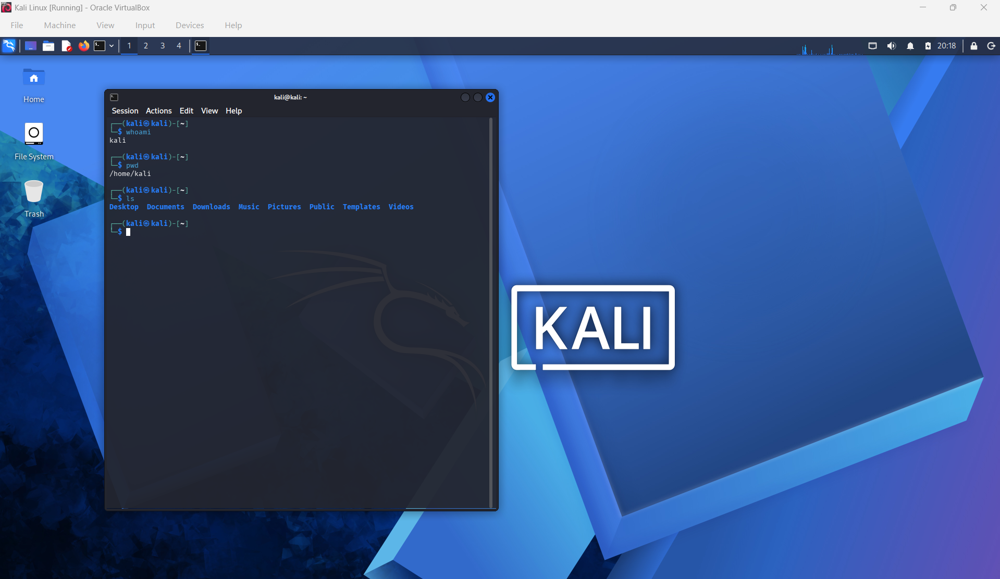
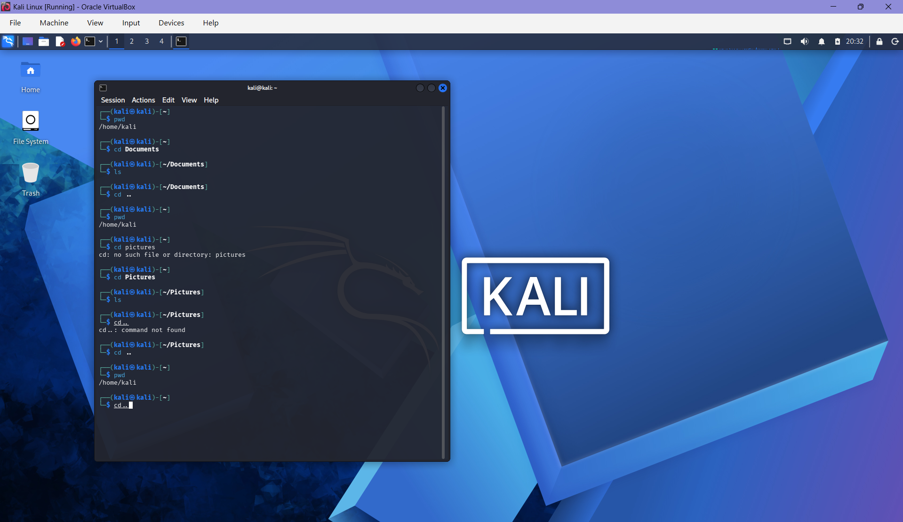

# Linux Basics

This document tracks my progress learning Linux fundamentals in my cybersecurity home lab.

## First Linux Commands

### whoami

Purpose:
Identifies the currently logged-in user

whoami
Result:
kali

### pwd

Purpose:
Who's the current working directory

pwd
Result:
/home/kali

### ls

Purpose:
Lists files and directories in the current location

ls
Result:
Desktop
Documents
Downloads
Music
Pictures
Public
Templates
Videos

### cd

Purpose: 
Change directory

cd Documents
Result:
/home/kali/Documents

## Evidence

Screenshot showing my first Linux commands in Kali:

Screenshot showing how to move between directories using cd and ..

