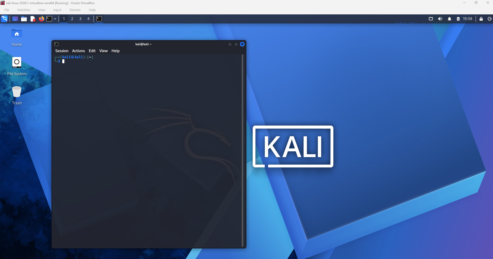
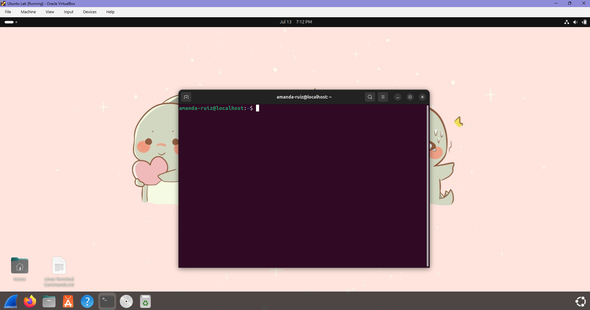
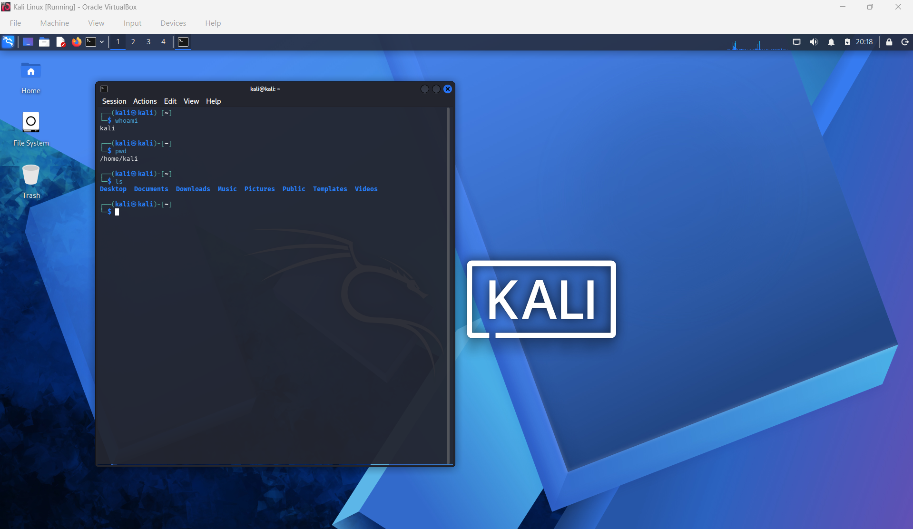
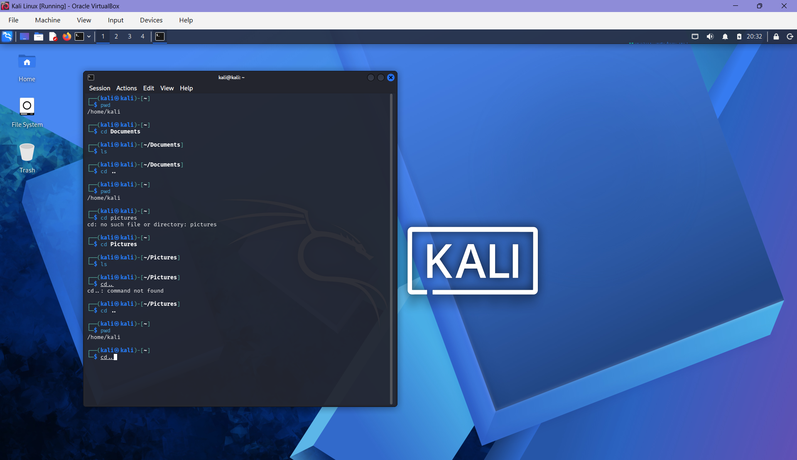

# Linux Basics

## Introduction

Learning Linux is a fundamental step toward developing cybersecurity skills. Since many security tools, servers, and enterprise environments rely on Linux, becoming comfortable with the command line is an essential part of building a strong technical foundation.

This document records my progress as I learn Linux through hands-on practice in my home lab. Rather than simply completing exercises, I am documenting the commands I learn, what they accomplish, and how they support future cybersecurity work.

## Getting Comfortable with the Kali Linux Environment

Before learning Linux commands, I spent time becoming familiar with the Kali Linux desktop environment and terminal. Understanding the layout of the operating system and how to access the command line is an important first step before performing system administration or security-related tasks.



## Exploring Ubuntu Linux

In addition to Kali Linux, I began working with Ubuntu to become familiar with another widely used Linux distribution. Although the desktop environments differ, both operating systems rely on many of the same command-line tools and Linux concepts.



## First Linux Commands

### `whoami`

**Purpose**

Displays the username of the currently logged-in user.

**Command**

```bash
whoami
```

**Result**

```text
kali
```

### `pwd`

**Purpose**

Displays the current working directory.

**Command**

```bash
pwd
```

**Result**

```text
/home/kali
```

### `ls`

**Purpose**

Lists the files and directories in the current location.

**Command**

```bash
ls
```

**Result**

```text
Desktop
Documents
Downloads
Music
Pictures
Public
Templates
Videos
```

### `cd`

**Purpose**

Changes the current working directory.

**Command**

```bash
cd Documents
```

**Result**

```text
/home/kali/Documents
```

## Why These Commands Matter in Cybersecurity

Although these commands are simple, they are foundational for security work. Analysts frequently use the Linux command line to navigate systems, locate files, review logs, manage tools, and investigate potential security events.

## Lab Evidence

The following screenshots document my first interactions with the Linux command line while working in the Kali Linux virtual machine.

### Basic Linux Commands

This screenshot demonstrates the use of basic Linux commands, including `whoami`, `pwd`, and `ls`.



### Directory Navigation

This screenshot demonstrates navigating between directories using the `cd` command.



## Lessons Learned

Learning basic Linux commands has improved my confidence using the command line and navigating the Linux file system. These foundational skills are essential for cybersecurity because many security tools, servers, and investigative tasks rely on command-line interaction.

As I continue developing this home lab, I plan to build on these fundamentals by learning file permissions, user and group management, networking commands, package management, SSH administration, and Bash scripting.

## Future Topics

Future Linux topics to be added as I continue expanding my home lab:

- File permissions
- User and group management
- Package management
- Networking commands
- SSH administration
- Bash scripting
