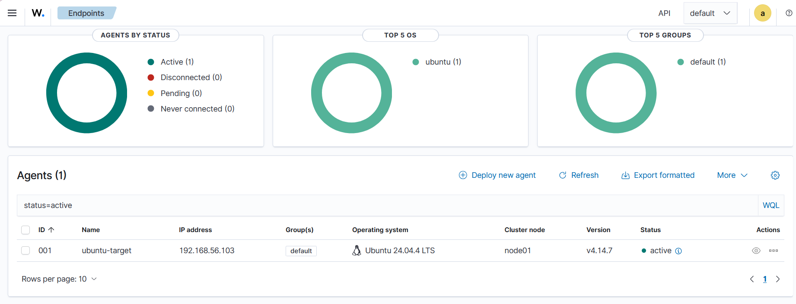
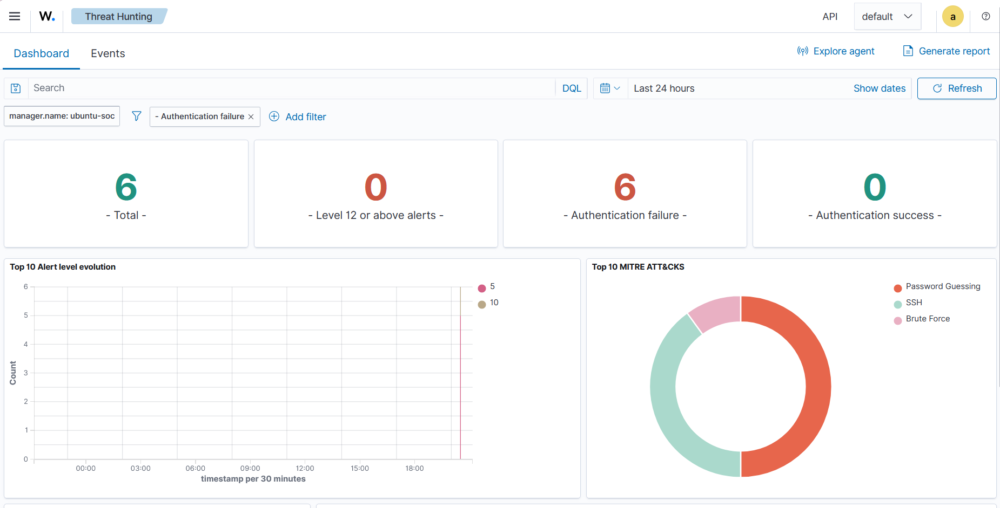

# Wazuh Security Monitoring

## Overview

This document outlines the deployment and initial testing of Wazuh within the cybersecurity home lab environment.

Wazuh was added to the Ubuntu SOC virtual machine to provide security monitoring, log analysis, alert generation, and endpoint visibility.

## Wazuh Architecture

The Wazuh deployment uses a three-virtual-machine architecture:

| Virtual Machine | Purpose |
|-----------------|---------|
| Kali Linux | Security testing and simulated attacker activity |
| Ubuntu SOC | Wazuh Manager, Indexer, and Dashboard |
| Ubuntu Target | Monitored endpoint running the Wazuh Agent |

## Wazuh Installation

Wazuh was installed as an all-in-one deployment on the Ubuntu SOC virtual machine.

Installed components:

- Wazuh Manager
- Wazuh Indexer
- Wazuh Dashboard
- Filebeat integration

The Wazuh Dashboard was accessed through a web browser from the Windows host machine using the Ubuntu SOC host-only network IP address.

A self-signed certificate warning was expected because the dashboard uses a local certificate.

## Network Configuration

Wazuh communication occurs over the isolated host-only network.

| System | Purpose |
|--------|---------|
| Ubuntu SOC | Wazuh Manager |
| Ubuntu Target | Monitored endpoint |

The Ubuntu Target system was successfully connected to the Wazuh Manager through the Wazuh Agent.

## Agent Deployment

The Ubuntu Target machine was registered as a Wazuh endpoint.

Agent configuration:

- Agent name: ubuntu-target
- Operating system: Ubuntu Linux
- Package type: DEB amd64
- Connection status: Active

The Wazuh Dashboard confirmed successful agent communication.



## Detection Validation: SSH Authentication Monitoring

### Objective

Validate that Wazuh can detect and report suspicious authentication activity.

### Simulation

A controlled SSH authentication test was performed from Kali Linux against the Ubuntu Target machine.

Activity performed:

- Multiple failed SSH login attempts
- Incorrect password attempts used to generate authentication events

### Detection Results

Wazuh successfully detected the activity and generated alerts related to:

- Authentication failures
- SSH password guessing
- Brute force behavior



The event demonstrated the complete monitoring workflow:

```
Kali Linux
    |
    | Failed SSH login attempts
    v
Ubuntu Target
    |
    | Authentication logs collected
    v
Wazuh Agent
    |
    v
Wazuh Manager
    |
    v
Wazuh Dashboard Alert
```

## Skills Practiced

This exercise demonstrated:

- SIEM deployment
- Endpoint agent installation
- Linux service management
- Network troubleshooting
- Log collection
- Security alert investigation
- Authentication event analysis

## Future Wazuh Projects

Planned exercises include:

- File Integrity Monitoring
- Vulnerability Detection
- MITRE ATT&CK technique mapping
- Additional endpoint monitoring
- Security event investigation workflows
